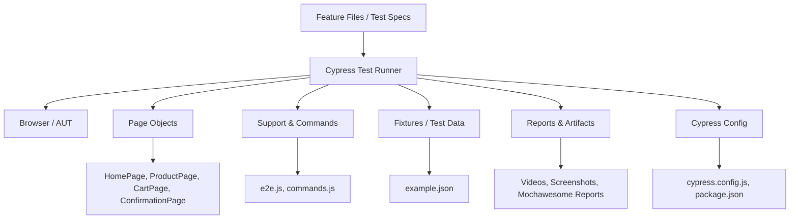

# Cypress Automation Framework

## Overview

This repository contains a Cypress automation framework for web application testing using:

- Cypress `v14.x`
- BDD with Cucumber feature files
- Page Object Model (POM)
- Mochawesome reporting
- Cypress Dashboard integration with recording

The project is structured to support reusable test cases, business-flow automation, and maintainable page object abstractions.

## Key Features

- BDD-style tests in `cypress/e2e/demoexamples/BDD/*.feature`
- Page object classes in `cypress/support/PageObjects`
- Test data and fixtures in `cypress/fixtures`
- Support commands and custom logic in `cypress/support/e2e.js`
- Cypress configuration for Cucumber preprocessor and Esbuild bundler
- Multiple npm scripts for headless, headed, browser-specific, and recorded runs

## Project Architecture

### Architecture Diagram



### Diagram Summary

`cypress.config.js` directs Cypress to run BDD feature files from `cypress/e2e/demoexamples/BDD`. The runner executes tests with support logic, page objects, fixtures, and outputs reports in HTML and video.

## Repository Structure

- `cypress/`
  - `e2e/`
    - `demoexamples/` - main demo test specs and feature files
    - `1-getting-started/` - Cypress example specs
  - `fixtures/` - test data files
  - `reports/` - generated HTML reports and videos
  - `support/`
    - `commands.js` - custom Cypress commands
    - `e2e.js` - global support and hooks
    - `PageObjects/` - reusable page object classes
- `cypress.config.js` - Cypress configuration and node event setup
- `package.json` - install dependencies and execute scripts

## Prerequisites

- Node.js `>= 18`
- npm `>= 9`
- Chrome, Firefox or Edge installed for browser runs

## Setup

1. Open a terminal in the repository root.
2. Install dependencies:

```bash
npm install
```

## Run Tests

### Headless run (default browser)

```bash
npm test
```

### Run in headed mode

```bash
npm run headedtest
```

### Run in Chrome headed mode

```bash
npm run chrometest
```

### Run in Firefox headed mode

```bash
npm run firefoxtest
```

### Run in Edge headed mode

```bash
npm run ietest
```

### Run POM tests with Cypress Cloud recording

```bash
npm run reportkeypomtest
```

### Run all POM specs with recording

```bash
npm run reportkeypom
```

### Run a specific POM spec with recording in headed mode

```bash
npm run pomtestheaded
```

## Cypress Configuration

- `specPattern`: `cypress/e2e/demoexamples/BDD/*.feature`
- Cucumber preprocessor plugin enabled via `@badeball/cypress-cucumber-preprocessor`
- Esbuild bundler configured via `@bahmutov/cypress-esbuild-preprocessor`

## Test Design Notes

- Feature files are used for business-readable BDD scenarios.
- Step definitions are located under `cypress/e2e/demoexamples/BDD/ecommerce/`.
- Page object classes encapsulate page locators and actions for maintainability.
- Fixtures are used to store reusable test data.

## Reporting

- Test execution artifacts are generated in `cypress/reports/html`
- Videos are collected under `cypress/reports/html/videos`
- For dashboard recording, Cypress uses the key configured in npm scripts

## Tips

- Use `npx cypress open` to launch the interactive Cypress Test Runner.
- Ensure the Cypress Dashboard key stays private when sharing the repository.

## Contact

Author: `Arun M`

---

## ASCII Architecture Diagram

```
[Feature Files] ---> [Cypress Runner] ---> [Browser / AUT]
                     |                  \-> [Reports & Videos]
                     |\
                     | \-> [Page Objects]
                     | \-> [Support / Commands]
                     | \-> [Fixtures / Data]
                     \-> [Cypress Config]
```
